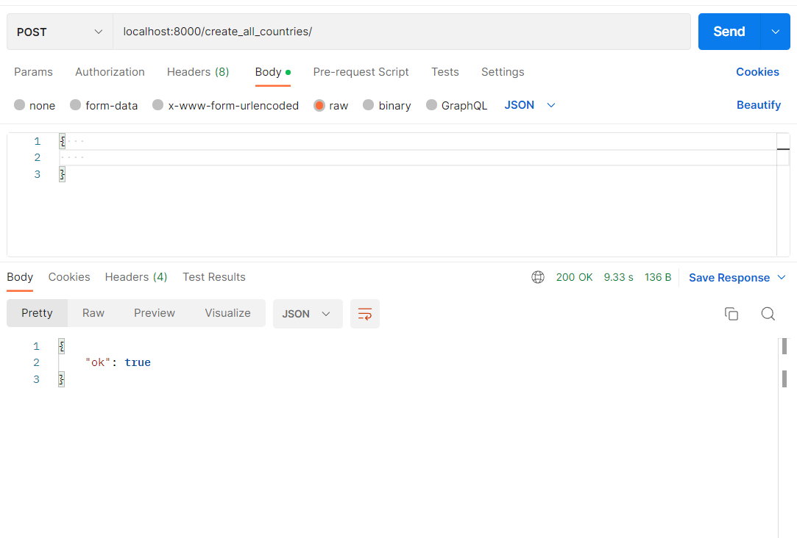
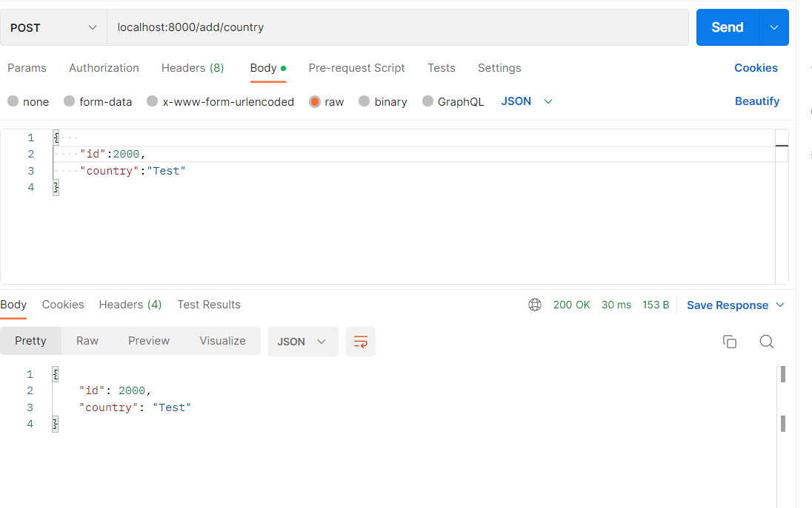
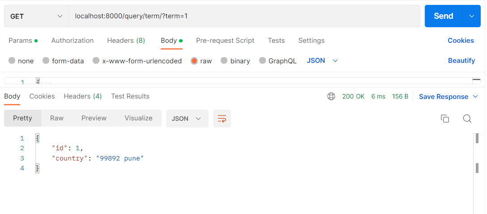
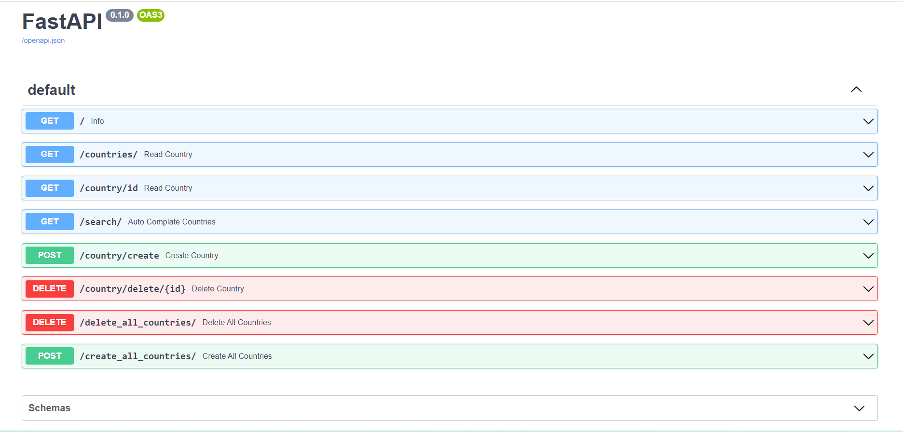
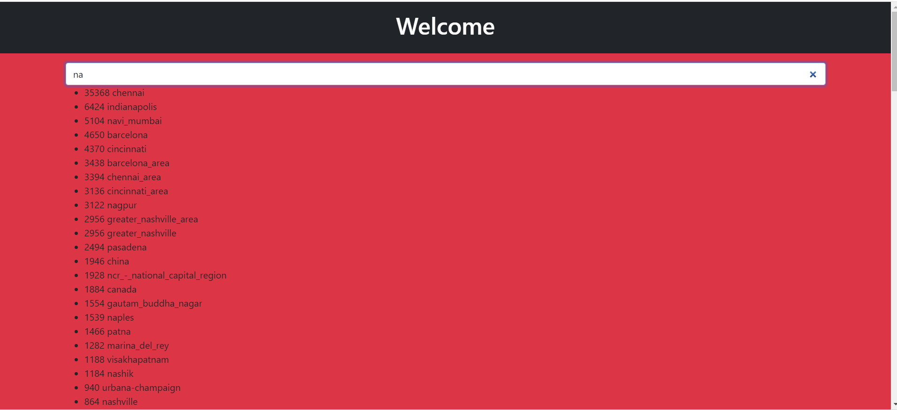

# studypaq
Client File mail.py
## Study PAQ SEARCH API Implementation

## Assumptions 
- High Performance
- Highly scalable
- Microservice 
- Not worrying about front end
- Not worrying about feature rich application
- No data validation required
- Autoscale system
- Nosql support (database scaling) 
- All most Production ready(set to env vars)
- Tested Locally 
- No security implemented 
## Trade Offs to design APIs
- django(feature rich) < Flask (very light weight)
- Fast api(performance/speed) > flask(performance/speed)
- Choosing FastAPI Over Flask, DRF, Django
- High performance
- Inbuilt API docs
- Async support
- Horizontal scalable db since it supports no sql 
- Microservice that is almost production ready 

## I have configured this project 

- Development Environment
- Production Environment (Not Deployed to any live environment -- not having any space)

### Features

- Upload All data to database at once
    - just replace db.txt file in root directory with your
    - and call api "localhost:8000/create_all_countries/"
- Delete All data of database 
    - just call localhost:8000/delete_all_countries/
- Insert induvidual country
- supports best search
- delete individual data provided id of item
- Having Good inbuit docs
- Implemented Using fast api considering performance first

### For Production Environment
## On any cloud service

- create any vitual machine/ serverless host
- generate virtual environment
- install all dependecies in virtual environment using command "pip install requirement.txt"
- just run your api 

### Installation Process

- on your home/choice run mkdir studypaq 
- cd studypaq
- make sure you have installed virtual environment
- for win
    - py -m venv myenv
- for Linux like system
    - venv myenv
- git clone ""
- pip install requirement.txt

## API Calles 

### 1. Loading and Deleting Bulk Data

- call localhost:8000/create_all_countries/ 

- call localhost:8000/delete_all_countries/

#### Note Make sure to create_all_countries from txt file, which contains only city names in strings and run this command on top of "/create_country/" since "create_all_countries" call creates db having id from 1 to last entry in text db. Not implemented this edge case. will improve in next version. Alternative workaround just call "/delete_all_countries/" then call "/create_all_countries/"

### 2. Creating a country 

- call localhost:8000/add/country/ with post 
- {"id":someid:int, "countryName":"Some Name"}

### 3. Deleting a country 

- call localhost:8000//delete/country/id

### 3. Getting a country 

- call localhost:8000/term/?term=1

### 3. Getting all countries 

- call localhost:8000/countries

### Access Local Inbuilt API docs Open API standard

- localhost:8000/docs

- localhost:8000/redocs

### Accessing Front End 

- localhost:8000
- search in search field 

